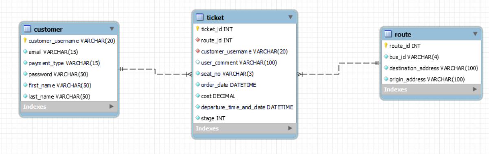

# Bogadh Introduction
An Irish bus transport full stack project for QA training. 'Bogadh' means 'to move' in Irish

## Project Brief
The brief for the project at it's current state was to design a Flask web application which provided CRUD functionality from the created database. Tests were needed in this application with a project management tool and a version control system to host the source code. The brief had changed overtime, which affected my project management tool and project design. 

## App Design
Bogadh is a bus transport system for users all across the island of Ireland. It is similar to buying a ticket with the web application for Bus Éireann. A user may have many tickets associated with their account, the user will be able to access this account with their password. The tickets will include a route to differernt parts of the country. The cardinality for Ticket to Customer and Route is many-to-one.

Much of the information for the columns is self explantory. Some columns need some prior knowldge like stage, which means the position of when the customer gets on the bus relative to the destination address from the origin address, route_id is the unique route identifier in each route.

## CI Pipeline

![]

## Future Development
Passwords are stored directly into the database. This is not secure as it is not hashed. Ideally in the the next sprint, the data would be hashed with bcrypt to increase data privacy

