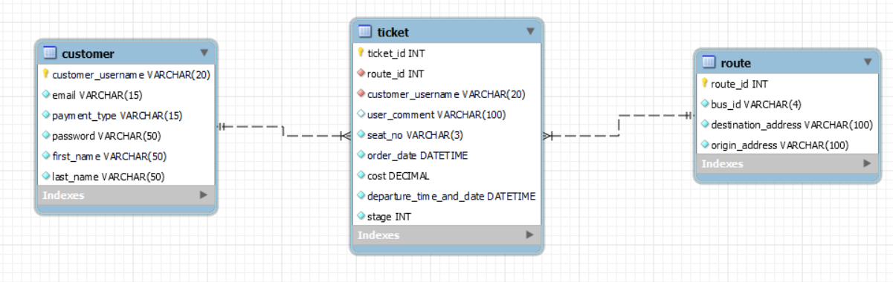
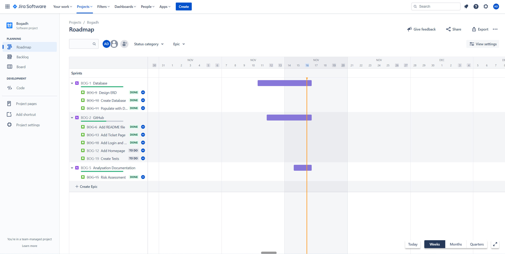
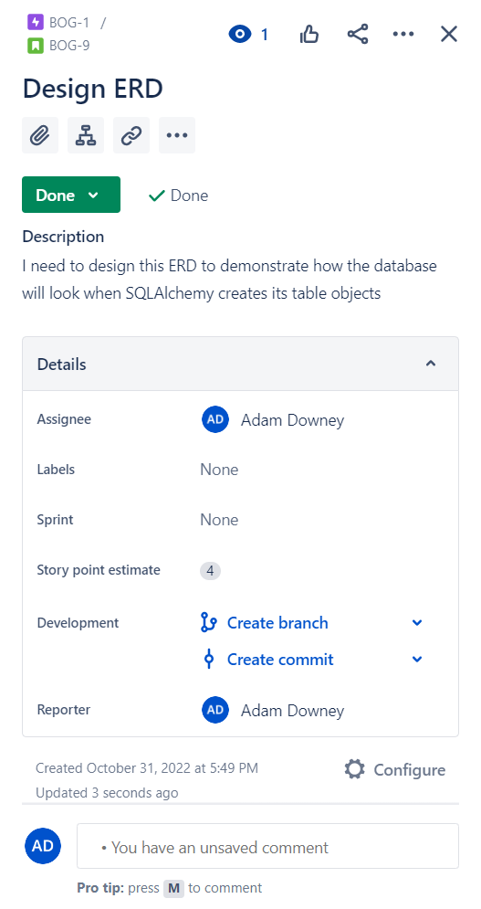
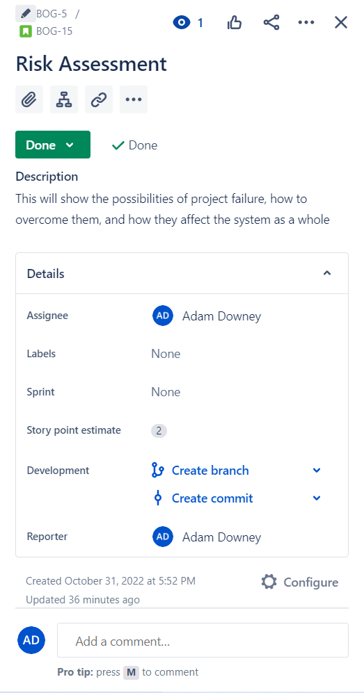
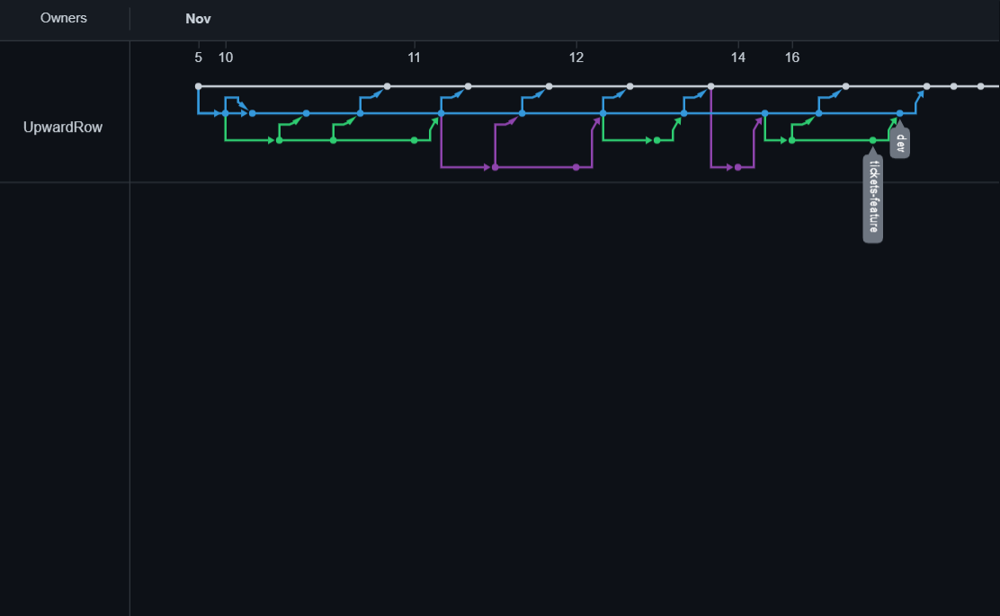
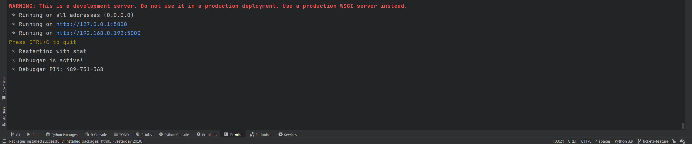
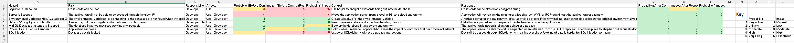

# Bogadh Introduction
An Irish bus transport full stack project for QA training. 'Bogadh' means 'to move' in Irish

# Project Overview

## Project Brief
The brief for the project at it's current state was to design a Flask web application which provided CRUD functionality from the created database. Tests were needed in this application with a project management tool and a version control system to host the source code. The brief had changed overtime, which affected my project management tool and project design. 

## App Design
Bogadh is a bus transport system for users all across the island of Ireland. It is similar to buying a ticket with the web application for Bus Éireann. A user may have many tickets associated with their account, the user will be able to access this account with their password. The tickets will include a route to differernt parts of the country. The cardinality for Ticket to Customer and Route is many-to-one.

Much of the information for the columns is self explantory. Some columns need some prior knowldge like stage, which means the position of when the customer gets on the bus relative to the destination address from the origin address, route_id is the unique route identifier in each route. The complete database is hosted inside MySQL Workbench.

## CI Pipeline
As mentioned, the project needed a few stages in it's CI pipeline. In the screenshot below there is a Jira screenshot of this project's board. The board was changed and reconsidered greatly as the marking scheme changed its deliverables. Most of the project has been completed, with descriptions in each Epic containing a child issue with allocated story points and a description. The story points varied and gave an estimate on the difficulty of the task, with 4 being the highest. 

[Link to the Jira board](https://adam-downey.atlassian.net/jira/software/projects/BOG/boards/2/roadmap?timeline=WEEKS)

This GitHub repo was used for the version control. Feature branch development was adapted, with multiple feature branches created that were pushed into dev, then pushed from dev into main once dev was stable. The screenshot shows this in use. Keep in mind that the direct pushes to main is the editing for the README.md file.

I used Flask's built in web server for the applicaiton. This was limited to a development server and would not be viable for use in a production environment

## Risk Assessment
This risk assessment was conducted on the application which allowed all of the risks to be considered before the application was developed. Some of the risks were not able to implemented given that the focus was elsewhere in the project.

There is a key on the right of the sheet which signifies how much of an impact that the risk has on the whole project. This risk rating changes after the control is put against the risk.

Some of the risks that were considered and covered:
* SQL injection was able to be limited with the SQLAlchemy toolkit incorporated into the project.
* Data of the wrong type was mostly covered because of custom and available validators
* A feature branch development processes was adopted to lessen the impact of errors that may come from data corruption 

## Testing
As mentioned testing was not able to be completed because of the complication of the database and the timeframe that was given.

## The Application
The login page is used for the user to insert their credentials to thenm be checked in the database and my custom validators in the models file. The idea was that the user logs in, and the username is saved to the session for the tickets, allowin the user to have tickets that they created. Errors with relationships caused this to not be implemented.

The tickets view has the base of CRUD functionality. We can see buying a ticket, viewing it, updating it, and deleting it. This is all styled with Bootstrap.

When a ticket is attempted to be purchased, a modal pops up on the screen with fields that are then passed to the form inside the applicaiton for database insertion. This does work for all of the keys except the foreign keys, which causes none of the data to be inserted. The error that shows is evidence that the data is being passed in.

This is the update modal for the application. The html is developed, but the actual functionality is only hardcoded. 

The delete button only gives a warning when clicked, it is not functional beyond that.

## Known Issues
* Passwords are stored directly into the database. This is not secure as it is not hashed. Ideally the data would be hashed with bcrypt to increase data privacy.

* The login system was designed by me, which took more time than I had. Implementing Flask-Login would have been easier, more realistic, and quicker.

* Due to a lack of time and error handling within the application for the database relationships, the testing was not attempted.

## Future Development
As well as fixing the known issues, I would like to be able to let all of the tickets to be shown inside the container on screen, growing and shrinking as the tickets are added and deleted.

